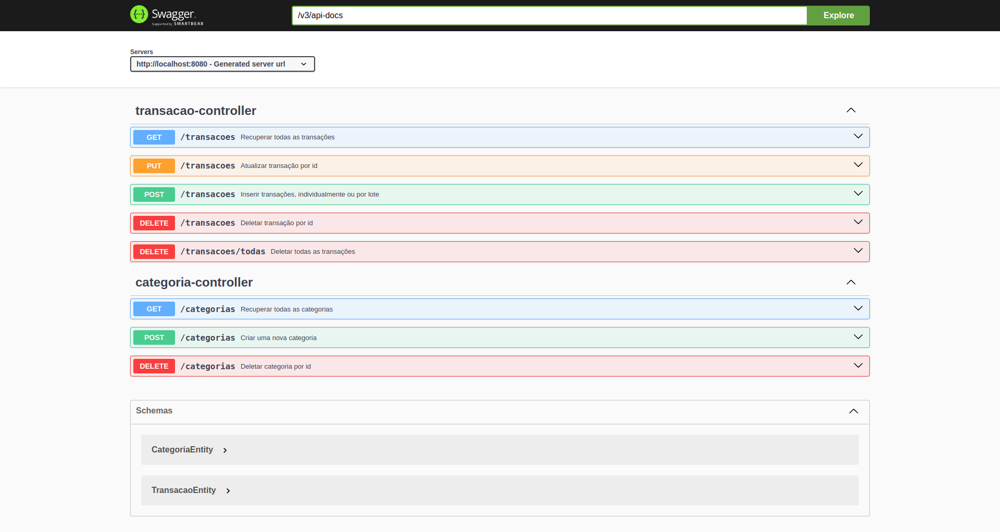
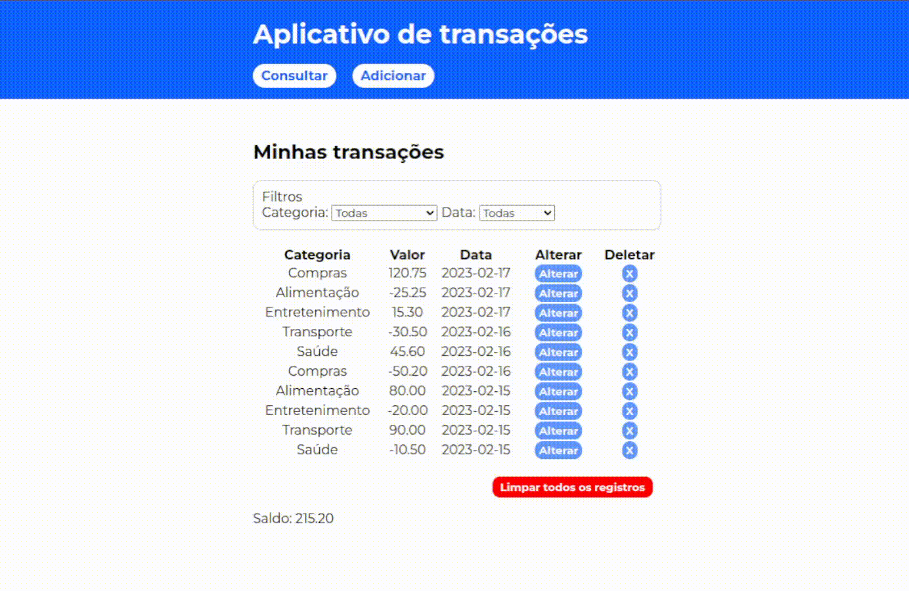

# Desafio IBM - Transações Financeiras

Essa é uma implementação de uma aplicação fullstack, com uso de Angular, Java com SpringBoot, e banco de dados MySQL. </br>É um aplicativo de controle de transações financeiras, no qual é possível recuperar, inserir, atualizar e deletar transações.


## Funcionalidades
- Consulta das informações das transações registradas (categoria, valor e data)
- Filtro de consulta por categoria e por data
- Consulta de saldo total e saldo parcial (por categoria e/ou data)
- Atualização de transações registradas
- Consulta e criação de categorias
- Inserção de novas transações, individualmente ou por lote
- Deleção de uma transação
- Limpar o registro de transações


## Instalação e execução local

Para rodar esta aplicação é necessário ter o Docker e o Docker Compose (v1.29 ou superior) instalados em sua máquina.

Certifique-se também de ter as portas 3306, 8080 e 4200 desocupadas


1. Clone o repositório e entre no diretório
```bash
  git git@github.com:lzaghi/desafio_transacoes_ibm.git
  cd desafio_transacoes_ibm
```

2. A partir da raiz do projeto, suba os containeres do banco de dados, back e front
```bash
  docker-compose up -d --build
```

A aplicação já estará rodando! :)</br>
Acesse ```http://localhost:4200``` para a experiência de usuário. O back-end estará rodando em ```http://localhost:8080```.


Para parar a aplicação, basta executar o comando na raiz do projeto
```bash
  docker-compose down --remove-orphans
```

## Documentação

A documentação completa da API, com todas as operações possíveis, pode ser consultada localmente em ```http://localhost:8080/swagger-ui.html``` após a aplicação estar rodando.



## Demonstração

<!--  -->



## Tecnologias utilizadas

Angular v15 (Node.js), SpringBoot (Java v17), MySQL, Docker.

